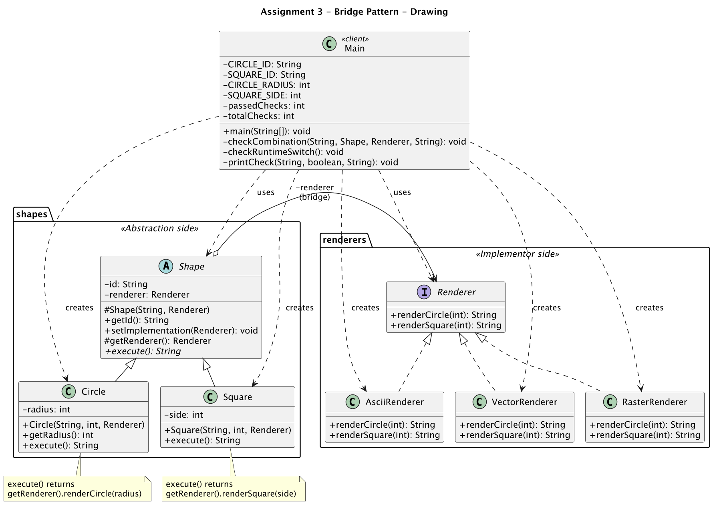

# Assignment 3 — Bridge Pattern

**Student:** Anarov Daniyal · **Group:** SE-2530 · **Course:** ShP-2216 Software Design Patterns · **Topic:** A — Drawing

**Repository:** https://github.com/Collector119/asik-aitu-sdp3 · **Base commit:** `e67f2e5` · **Extension commit:** `4eb40fd` · **Submitted commit:** `SUBMITTED_COMMIT`

## 1. Two dimensions and why Bridge fits

My program draws shapes. It changes in two directions that do not depend on each other:

* **what** is drawn — the shape: `Circle` (radius 2) and `Square` (side 3);
* **how** it is drawn — the renderer: `VectorRenderer`, `RasterRenderer` and later `AsciiRenderer`.

If I solved this with inheritance only, I would need a class for every pair: `VectorCircle`,
`RasterCircle`, `VectorSquare`, `RasterSquare`, and two more for ASCII. Every new shape or renderer
multiplies the number of classes. Bridge splits the two directions into two hierarchies. The
abstraction `Shape` stores a reference of the interface type `Renderer`, which it gets through its
constructor, and passes the low-level drawing work to it. So 2 shapes and 3 renderers need 2 + 3
classes instead of 2 × 3, and the renderer of an existing shape can be replaced at runtime with
`setImplementation(...)`.

## 2. UML class diagram



## 3. Clean Code excerpts

**Separation of responsibilities.** A shape knows its own data, a renderer knows only how to draw.
`Circle` does not build any text itself, it only chooses which low-level operation to call:

```java
public String execute() {
    return getRenderer().renderCircle(radius);
}
```

*Benefit:* changes to the output format stay inside the renderers, and changes to a shape's data stay
inside the shape.

**Meaningful names.** The names repeat the roles of the assignment, so a reader can find each role
without comments: `Shape`, `Renderer`, `setImplementation(Renderer renderer)`, `checkRuntimeSwitch()`,
and constants such as

```java
private static final int CIRCLE_RADIUS = 2;
private static final int SQUARE_SIDE = 3;
```

*Benefit:* the sample values are written once and have a name, instead of magic numbers in seven places.

**Small focused methods.** Each method in `Main` does one job: `checkCombination` runs one
shape/renderer pair, `checkRuntimeSwitch` runs T5, and `printCheck` only counts and prints:

```java
private static void printCheck(String checkId, boolean passed, String details) {
    totalChecks++;
    if (passed) {
        passedChecks++;
    }
    System.out.println(checkId + " " + (passed ? "PASS" : "FAIL") + " | " + details);
}
```

*Benefit:* every method can be read and explained on its own.

**Avoidance of duplication.** Six of the seven checks have the same workflow — execute, compare,
print. It is written once in `checkCombination`, and the checks differ only in their data:

```java
checkCombination("T1", new Circle(CIRCLE_ID, CIRCLE_RADIUS, vector), vector,
        "VECTOR path: circle radius=2");
```

*Benefit:* T6 and T7 were added with two calls and no new checking code. The PASS/FAIL label and the
summary are computed in one place.

**Encapsulation of state.** The ID and the dimensions are `private final`, so they cannot change after
construction. The bridge field is `private`; subclasses read it through `getRenderer()`, and only
`setImplementation` can replace it:

```java
private final String id;
private Renderer renderer;
```

*Benefit:* T5 can rely on the fact that switching the renderer cannot touch the ID or the radius.

## 4. Adding I3, trade-off and comparison with Adapter

**How I3 was added.** First I committed the working version with two renderers (`e67f2e5`). Then I
added `AsciiRenderer`, which implements the same two methods of `Renderer`, and added T6 and T7 to
`Main` (`4eb40fd`). `extension.diff` shows that in `src/` only `AsciiRenderer.java` (new) and
`Main.java` changed. `Shape`, `Circle`, `Square`, `Renderer`, `VectorRenderer` and `RasterRenderer`
stayed unchanged, because shapes depend only on the `Renderer` interface and never on a concrete class.

**Trade-off.** Bridge makes adding a renderer cheap, but adding a shape is not free: the `Renderer`
interface has one method per shape (`renderCircle`, `renderSquare`). A new `Triangle` would need a new
`renderTriangle` method in the interface and in all three renderers.

**Bridge vs Adapter.** Both patterns use composition and an interface, but the intent is different.
Adapter is applied *after* the classes exist: it wraps a class with an incompatible interface so that a
client can use it. Bridge is planned *up front*: `Shape` and `Renderer` were designed together, so that
both sides can grow independently. In my program nothing is incompatible — `AsciiRenderer` was written to
implement `Renderer` directly, so no adapter was needed. An adapter would be needed if I had to use an
existing third-party drawing class with different method names.

## References

1. Lecture 4, Bridge Pattern, ShP-2216 Software Design Patterns, Astana IT University, 2026.
2. E. Gamma, R. Helm, R. Johnson, J. Vlissides. *Design Patterns: Elements of Reusable Object-Oriented Software.* Addison-Wesley, 1994 — Bridge and Adapter.
3. A. Shvets. *Bridge.* Refactoring.Guru, https://refactoring.guru/design-patterns/bridge
